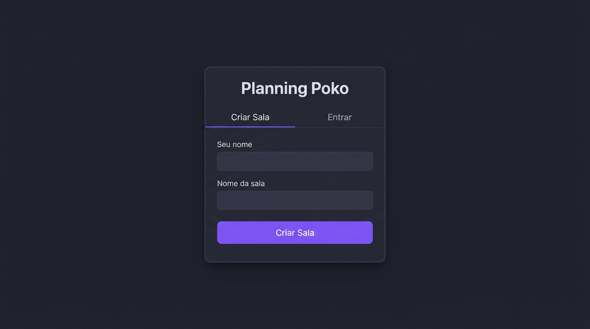
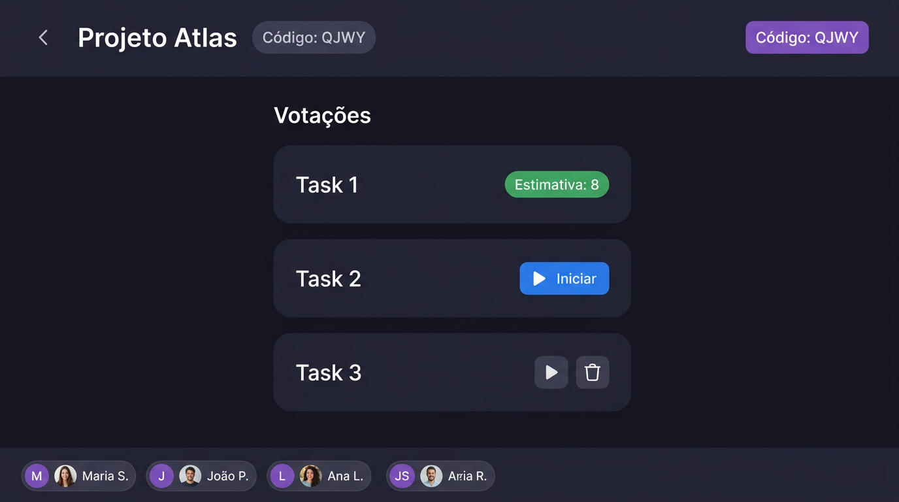
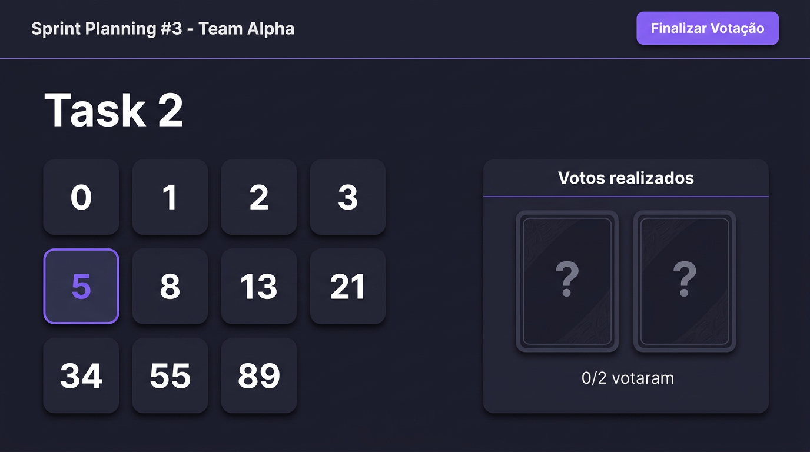
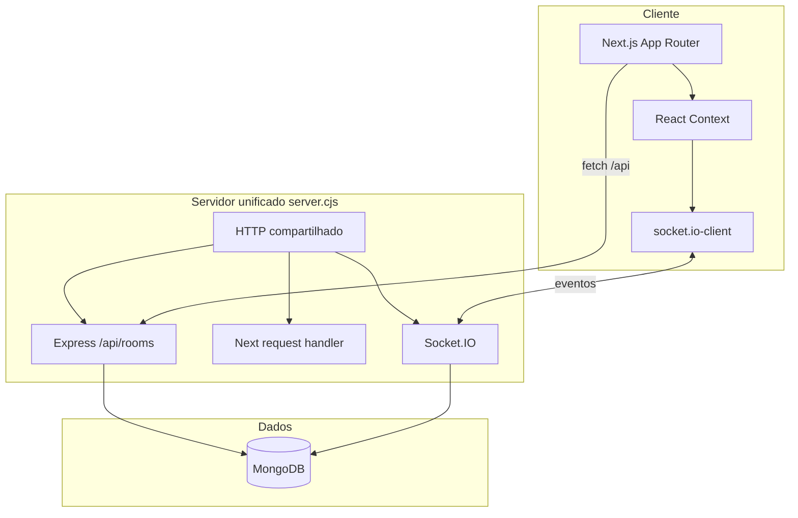

<div align="center">

# Planning Poko

**Salas de Planning Poker leves, em tempo real, com uma stack moderna e um deploy mentalmente simples.**

[](https://nextjs.org/)
[](https://react.dev/)
[](https://www.typescriptlang.org/)
[](https://www.mongodb.com/)
[](https://socket.io/)

[Funcionalidades](#-funcionalidades) · [Arquitetura](#-arquitetura) · [Como rodar](#-como-rodar) · [Telas](#-telas)

</div>

---

## Visão geral

O **Planning Poko** é uma aplicação para **estimativa colaborativa** (Planning Poker): o time entra numa sala por **código de 4 letras**, vota em histórias com **cartas estilo Fibonacci**, **revela os votos ao mesmo tempo** e registra **estimativa final** por rodada.

O projeto foi pensado para ser **fácil de subir no Git** e **fácil de rodar localmente**: um único comando sobe **interface + API HTTP + WebSocket + conexão com o MongoDB**.

---

## Funcionalidades

- Sala com **código curto** e lista de participantes
- **CRUD implícito de rodadas** (histórias / votações) com ordem por **data de criação**
- **Fluxo de votação** com estados explícitos (`activeVoting`, `active_round_id` no banco)
- **Socket.IO** para broadcast de atualizações (`room-updated`, `vote-submitted`, etc.)
- **Persistência em MongoDB** (coleções `rooms`, `users`, `rounds`, `votes`)
- UI em **Next.js (App Router)** + **React** + **Bootstrap**, tema escuro customizado

---

## Telas

> Imagens em `docs/screenshots/` — mockups para portfólio; substitua por capturas reais se preferir.

| Início | Lista de votações |
|:------:|:-----------------:|
|  |  |

| Votação ativa | Resultados |
|:-------------:|:----------:|
|  |  |

---

## Arquitetura

### Monólito “consciente”

Embora tudo rode em **um processo Node** (porta única), o código **não é uma bola de lama**: camadas separadas permitem raciocinar como em serviços independentes.



**Por que isso é interessante no portfólio**

- **Um único host e uma única origem** eliminam dores de CORS e de “duas URLs” no front.
- O backend Express e o Socket.IO são **plugados no mesmo `http.Server`** que serve o Next — padrão clássico de *custom server*, ainda válido quando você precisa de WebSocket de primeira classe.
- O domínio continua **testável em camadas**: rotas HTTP em `backend/src/routes`, regras em `backend/src/models`, eventos em `backend/src/socket`.

### Padrão de listeners (event-driven no cliente)

O cliente não “adivinha” o estado global sozinho: combina **HTTP** (snapshot inicial / REST) com **assinaturas em eventos** Socket.IO.

- **`socketService`** encapsula `emit` / `on` e mantém um **registro de callbacks** por nome de evento (mini *pub/sub* no browser).
- **`RoomContext`** escuta `room-updated`, `user-joined`, `user-left` e reconcilia com o estado React — o servidor é a **fonte de verdade** para `activeVoting` e `currentRound`.

Isso é o mesmo **instinto arquitetural** de aplicações maiores (message bus, event listeners), só que em escala de time pequeno e latência baixa.

### Persistência (MongoDB)

Modelo mental próximo ao SQL que existia antes da migração: entidades **sala → usuários → rodadas → votos**, com **índices** para código único da sala e voto único por `(round_id, user_id)`. A rodada ativa durante votação é guardada em `rooms.active_round_id` para não “pular” para a história mais nova ao receber atualizações.

---

## Estrutura de pastas (resumida)

```
planning-poko/
├── server.cjs              # Entrada do monólito: dotenv, Mongo, Express, Next, Socket.IO
├── next.config.mjs
├── src/
│   ├── app/                # Rotas Next (App Router)
│   ├── pages/              # Telas reutilizadas pelas rotas (UI)
│   ├── context/            # RoomContext + estado global da sala
│   ├── services/           # apiService (fetch), socketService (listeners)
│   ├── components/
│   └── types/
├── backend/
│   └── src/
│       ├── routes/         # router Express montado em /api/rooms
│       ├── controllers/
│       ├── models/         # roomModelMongo.js — regras de negócio + Mongo
│       ├── socket/         # Handlers Socket.IO (servidor)
│       └── databaseMongo.js
├── docs/
│   └── screenshots/        # Capturas / mockups para README e portfólio
├── .env.example            # Modelo de variáveis (versionado)
└── .env                    # Seu ambiente local (não versionado — ver .gitignore)
```

---

## Como rodar

### Pré-requisitos

- **Node.js** (LTS recomendado)
- **MongoDB** rodando localmente (ex.: `mongodb://127.0.0.1:27017`)

### Instalação

```bash
git clone <seu-repositorio>
cd planning-poko
yarn install
cp .env.example .env    # ajuste se necessário
yarn dev
```

Abra **http://localhost:3000**

O comando `yarn dev` executa `node server.cjs`, que:

1. Carrega o **`.env` da raiz** (e só então o `backend/.env`, se existir, para chaves faltantes)
2. Conecta ao **MongoDB** e garante índices
3. Sobe **Express** em `/api/rooms`
4. Sobe **Socket.IO** no mesmo servidor HTTP
5. Encaminha o restante das rotas para o **Next.js**

### Build para produção

```bash
yarn build
yarn start
```

> Em produção real, configure `NODE_ENV=production`, MongoDB gerenciado e revisão de `RESET_DB` / `CLEAR_DB_TABLES` (nunca `true` em ambiente compartilhado sem querer).

---

## Variáveis de ambiente

| Variável | Descrição |
|----------|-----------|
| `PORT` | Porta do servidor unificado (padrão `3000`) |
| `NODE_ENV` | `development` ou `production` |
| `MONGODB_URI` | URI de conexão (ex. local) |
| `MONGODB_DB` | Nome do database |
| `RESET_DB` | `true` = remove o database Mongo configurado na subida |
| `CLEAR_DB_TABLES` | `true` = apaga documentos das coleções |

O arquivo **`.env` na raiz** é o canônico para o app monolítico. O backend em `backend/` (modo standalone) também carrega **`../../.env`** primeiro — passo útil para testes ou scripts.

---

## Scripts

| Comando | O quê |
|--------|--------|
| `yarn dev` | Desenvolvimento (server unificado) |
| `yarn build` | Build Next |
| `yarn start` | Produção (server unificado) |
| `yarn lint` | ESLint |

---

## Licença

Uso livre para portfólio e estudo — ajuste uma licença (MIT, etc.) se for publicar como open source formal.

---

<div align="center">

Feito com foco em **clareza de arquitetura** e **DX** para quem quer mostrar no portfólio que *monólito* não significa *sem design*.

</div>
